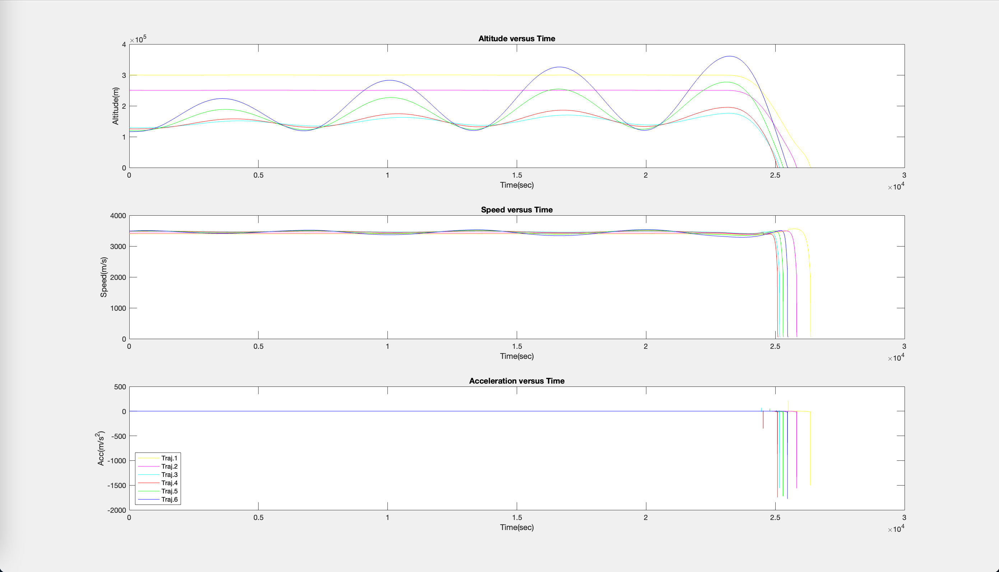
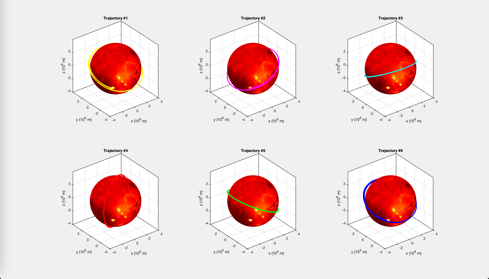
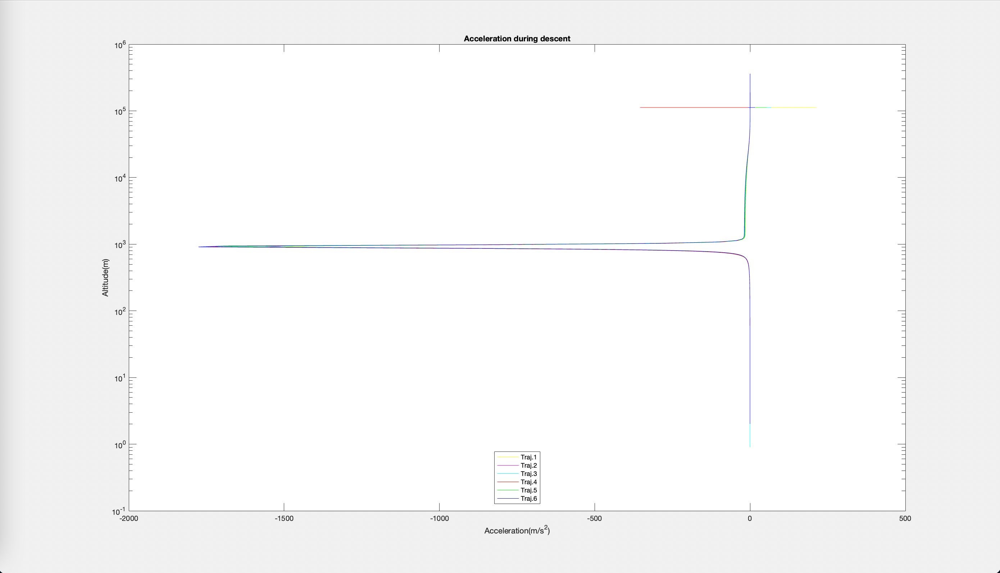

# Simulation of Mars Landing
This project simulated 6 different trajectories of capsules landing on Mars. The parachute is activated at a certain altitute. Physical parameters include mass, gravity, air drag, air density, thruster, etc. Data visualization include landing time, landing speed, orbital period.
### In the mars-landing folder, open project.m to run the simulation and see results
## Position Data Visualization

## Trajectory Data Visualization

## Parachute Data Visualization

